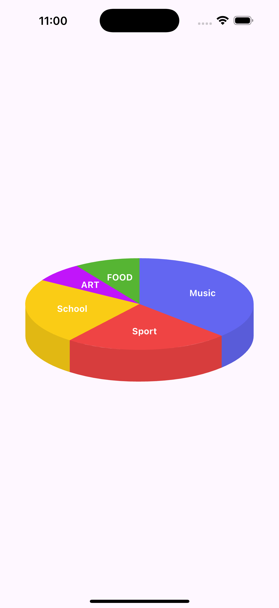

<!--
This README describes the package. If you publish this package to pub.dev,
this README's contents appear on the landing page for your package.

For information about how to write a good package README, see the guide for
[writing package pages](https://dart.dev/tools/pub/writing-package-pages).

For general information about developing packages, see the Dart guide for
[creating packages](https://dart.dev/guides/libraries/create-packages)
and the Flutter guide for
[developing packages and plugins](https://flutter.dev/to/develop-packages).
-->

This package draws 3d Pie Chart using Custom Painter 

## Features

 - Supports 3d view of Pie Chart
 - Adjustable dept of the Pie Chart 



## Getting started

add package into your pubspec.yml file

## Usage


```dart
class ExampleApp extends StatelessWidget {
  const ExampleApp({super.key});

  @override
  Widget build(BuildContext context) {
    return Scaffold(
      body: Center(
        child: ThreeDPieChart(
          data: _getChartData(),
          options: PieChartOptions(
            height: 400,
            width: 400,
            depthDarkness: 0.9,
            ellipseRatio: 0.4,
            shadowHeight: 50,
          ),
        ),
      ),
    );
  }

  List<ChartData> _getChartData() {
    return [
      ChartData(category: 'Music', value: 80, color: Color(0xFF6366F1)),
      ChartData(category: 'Sport', value: 50, color: Color(0xFFEF4444)),
      ChartData(category: 'School', value: 50, color: Color(0xFFFACC15)),
      ChartData(category: 'ART', value: 15, color: Color(0xFFC115FA)),
      ChartData(category: 'FOOD', value: 20, color: Color(0xFF56B533)),
    ];
  }
}
```

## Additional information

If you found any error, open ticket on Github.

Please feel free to start Contribution. It still needs lot of features.

